# 📋 Sistema Griver - Documentación Técnica Completa
## Plataforma de Gestión de Cursos de Inducción Empresarial

---

## 📖 Tabla de Contenidos

1. [Descripción General del Sistema](#1-descripción-general-del-sistema)
2. [Arquitectura y Tecnologías](#2-arquitectura-y-tecnologías)
3. [Sistema de Roles y Permisos](#3-sistema-de-roles-y-permisos)
4. [Funcionalidades por Módulo](#4-funcionalidades-por-módulo)
5. [Componentes Principales](#5-componentes-principales)
6. [Flujos de Trabajo y Procesos](#6-flujos-de-trabajo-y-procesos)
7. [Base de Datos y Tipos](#7-base-de-datos-y-tipos)
8. [Autenticación y Seguridad](#8-autenticación-y-seguridad)
9. [Metodología Ágil Implementada](#9-metodología-ágil-implementada)
10. [Configuración y Deployment](#10-configuración-y-deployment)
11. [APIs y Servicios](#11-apis-y-servicios)
12. [Testing y Calidad](#12-testing-y-calidad)
13. [Performance y Optimización](#13-performance-y-optimización)
14. [Consideraciones para Migración C#](#14-consideraciones-para-migración-c)

---

## 1. Descripción General del Sistema

### 🎯 Propósito
El **Sistema Griver** es una plataforma web integral de gestión de cursos de inducción empresarial diseñada específicamente para optimizar los procesos de capacitación y onboarding en la empresa Griver. 

### 🏢 Contexto Empresarial
- **Empresa**: Griver (Corporativo)
- **Objetivo**: Digitalización completa del proceso de inducción
- **Usuarios Target**: Administradores, RH, Empleados, Becarios
- **Modalidad**: 100% Digital, Responsivo, Multi-dispositivo

### 🚀 Características Principales
- **Gestión Multi-Rol**: 4 tipos de usuarios con permisos específicos
- **Cursos Interactivos**: Videos, documentos, evaluaciones
- **Analytics Avanzado**: Métricas de progreso y rendimiento
- **Exportación de Reportes**: Excel con filtros avanzados
- **Diseño Corporativo**: Branding completo de Griver
- **Metodología Ágil**: Kanban + Scrum híbrido integrado

---

## 2. Arquitectura y Tecnologías

### 🏗️ Stack Tecnológico

#### **Frontend (Actual - React)**
```typescript
// Core Framework
React 18+ con TypeScript
Vite como bundler
Tailwind CSS v4.0 para styling

// UI/UX Components
Radix UI como biblioteca base
Shadcn/ui para componentes específicos
Lucide React para iconografía
Motion/React para animaciones

// Estado y Data
Context API para estado global
React Hook Form + Zod para formularios
LocalStorage para persistencia

// Testing y Calidad
Jest + React Testing Library
ESLint + Prettier
TypeScript strict mode
```

#### **Arquitectura de Componentes**
```
Sistema Feature-Based con separación clara:

/components
├── features/           # Funcionalidades por dominio
│   ├── auth/          # Autenticación
│   ├── courses/       # Gestión de cursos
│   ├── users/         # Gestión de usuarios
│   ├── analytics/     # Métricas y reportes
│   └── settings/      # Configuración
├── common/            # Componentes reutilizables
├── ui/               # Sistema de diseño base
└── forms/            # Formularios especializados
```

### 🔧 Patrones de Diseño Implementados

#### **1. Compound Component Pattern**
```typescript
// Ejemplo: CourseCard
<CourseCard>
  <CourseCard.Header>
    <CourseCard.Title />
    <CourseCard.Status />
  </CourseCard.Header>
  <CourseCard.Content />
  <CourseCard.Actions />
</CourseCard>
```

#### **2. Custom Hooks Pattern**
```typescript
// Hooks especializados por dominio
useCourses()     // Gestión de cursos
useAuth()        // Autenticación
useAnalytics()   // Métricas
useNotifications() // Sistema de notificaciones
```

#### **3. Error Boundary Pattern**
```typescript
// Manejo de errores graceful en toda la app
<ErrorBoundary fallback={<ErrorFallback />}>
  <ComponenteApp />
</ErrorBoundary>
```

---

## 3. Sistema de Roles y Permisos

### 👥 Definición de Roles

#### **🔴 Administrador (Admin)**
```typescript
interface AdminPermissions {
  // Gestión completa del sistema
  canManageUsers: true;
  canManageCourses: true;
  canViewAnalytics: true;
  canExportReports: true;
  canConfigureSystem: true;
  canManageDepartments: true;
  canViewAllProgress: true;
  canDeleteData: true;
}
```

**Funcionalidades:**
- ✅ Dashboard completo con métricas avanzadas
- ✅ CRUD completo de usuarios (crear, editar, eliminar, asignar roles)
- ✅ CRUD completo de cursos (crear, editar, eliminar, asignar)
- ✅ Configuración del sistema (departamentos, categorías)
- ✅ Exportación de reportes con filtros avanzados
- ✅ Analytics avanzado con métricas de negocio
- ✅ Gestión de notificaciones del sistema

#### **🟡 Recursos Humanos (RH)**
```typescript
interface RHPermissions {
  // Gestión de contenido y progreso
  canManageCourses: true;
  canViewProgress: true;
  canExportReports: true;
  canAssignCourses: true;
  canManageEmployees: true; // Solo empleados, no admins
  canViewAnalytics: 'limited'; // Solo métricas de progreso
}
```

**Funcionalidades:**
- ✅ Dashboard de métricas de progreso
- ✅ Crear y editar cursos (contenido, videos, documentos)
- ✅ Asignar cursos a empleados y becarios
- ✅ Ver progreso de todos los usuarios
- ✅ Exportar reportes de progreso
- ✅ Gestionar empleados y becarios (no administradores)
- ❌ No puede acceder a configuración del sistema
- ❌ No puede gestionar otros usuarios RH o Admins

#### **🔵 Empleado (Employee)**
```typescript
interface EmployeePermissions {
  // Vista de consumo de cursos
  canViewAssignedCourses: true;
  canCompleteEvaluations: true;
  canViewOwnProgress: true;
  canDownloadCertificates: true;
}
```

**Funcionalidades:**
- ✅ Vista simplificada con cursos asignados
- ✅ Reproducir videos y descargar documentos
- ✅ Completar evaluaciones y exámenes
- ✅ Ver su propio progreso
- ✅ Descargar certificados de finalización
- ❌ No acceso a funciones administrativas
- ❌ No puede ver progreso de otros usuarios

#### **🟢 Becario (Intern)**
```typescript
interface InternPermissions {
  // Mismas funcionalidades que empleado
  canViewAssignedCourses: true;
  canCompleteEvaluations: true;
  canViewOwnProgress: true;
  canDownloadCertificates: true;
  // Funcionalidades adicionales específicas
  canAccessInternPrograms: true;
}
```

**Funcionalidades:**
- ✅ Mismas funcionalidades que Empleado
- ✅ Acceso a programas específicos de becarios
- ✅ Cursos especializados para inducción de becarios

### 🔐 Matriz de Permisos

| Funcionalidad | Admin | RH | Employee | Intern |
|---------------|-------|----|---------|---------| 
| Ver Dashboard Completo | ✅ | ❌ | ❌ | ❌ |
| Ver Dashboard RH | ✅ | ✅ | ❌ | ❌ |
| Ver Vista Cliente | ✅ | ✅ | ✅ | ✅ |
| Crear Usuarios | ✅ | ✅* | ❌ | ❌ |
| Editar Usuarios | ✅ | ✅* | ❌ | ❌ |
| Eliminar Usuarios | ✅ | ❌ | ❌ | ❌ |
| Crear Cursos | ✅ | ✅ | ❌ | ❌ |
| Editar Cursos | ✅ | ✅ | ❌ | ❌ |
| Eliminar Cursos | ✅ | ❌ | ❌ | ❌ |
| Asignar Cursos | ✅ | ✅ | ❌ | ❌ |
| Ver Progreso Todos | ✅ | ✅ | ❌ | ❌ |
| Ver Progreso Propio | ✅ | ✅ | ✅ | ✅ |
| Exportar Reportes | ✅ | ✅ | ❌ | ❌ |
| Configurar Sistema | ✅ | ❌ | ❌ | ❌ |
| Analytics Avanzado | ✅ | ❌ | ❌ | ❌ |

*RH puede gestionar solo Empleados e Internos, no Admins ni otros RH

---

## 4. Funcionalidades por Módulo

### 📊 Módulo Dashboard

#### **Dashboard Administrativo**
```typescript
interface AdminDashboardData {
  // Métricas principales
  totalUsers: number;
  activeCourses: number;
  completionRate: number;
  avgCourseTime: number;
  
  // Gráficos y visualizaciones
  userProgressChart: ChartData[];
  courseCompletionTrend: ChartData[];
  departmentAnalytics: DepartmentMetrics[];
  
  // Actividad reciente
  recentActivity: Activity[];
  pendingApprovals: Course[];
}
```

**Componentes incluidos:**
- **MetricsCard**: Tarjetas de métricas principales
- **ProgressChart**: Gráfico de progreso de usuarios
- **CompletionTrendChart**: Tendencia de finalización de cursos
- **DepartmentBreakdown**: Desglose por departamentos
- **RecentActivity**: Actividad reciente del sistema
- **QuickActions**: Acciones rápidas (crear curso, usuario, etc.)

#### **Dashboard RH**
```typescript
interface RHDashboardData {
  // Métricas específicas de RH
  assignedCourses: number;
  pendingCompletions: number;
  teamProgress: number;
  averageScore: number;
  
  // Filtros y vistas
  departmentFilter: string[];
  timeRangeFilter: DateRange;
}
```

#### **Vista Cliente (Empleados/Becarios)**
```typescript
interface ClientDashboardData {
  // Cursos asignados
  assignedCourses: Course[];
  inProgressCourses: Course[];
  completedCourses: Course[];
  
  // Progreso personal
  overallProgress: number;
  certificatesEarned: number;
  timeSpent: number;
}
```

### 🎓 Módulo Gestión de Cursos

#### **Funcionalidades Principales**
```typescript
interface CourseManagementFeatures {
  // CRUD Operations
  createCourse(courseData: CourseInput): Promise<Course>;
  updateCourse(id: string, data: Partial<Course>): Promise<Course>;
  deleteCourse(id: string): Promise<void>;
  
  // Assignment Operations
  assignCourseToUsers(courseId: string, userIds: string[]): Promise<void>;
  assignCourseToDepartment(courseId: string, dept: string): Promise<void>;
  
  // Content Management
  uploadVideo(courseId: string, video: File): Promise<string>;
  uploadDocument(courseId: string, doc: File): Promise<string>;
  createEvaluation(courseId: string, evaluation: Evaluation): Promise<void>;
}
```

#### **Estructura de Curso**
```typescript
interface Course {
  id: string;
  title: string;
  description: string;
  department: string;
  category: CourseCategory;
  difficulty: 'Básico' | 'Intermedio' | 'Avanzado';
  estimatedDuration: number; // en minutos
  
  // Contenido
  modules: CourseModule[];
  videos: Video[];
  documents: Document[];
  evaluations: Evaluation[];
  
  // Metadata
  createdBy: string;
  createdAt: Date;
  updatedAt: Date;
  isActive: boolean;
  
  // Assignment
  assignedUsers: string[];
  assignedDepartments: string[];
  
  // Progress tracking
  completionCriteria: CompletionCriteria;
  passingScore: number;
}
```

#### **Tipos de Contenido**
```typescript
interface CourseModule {
  id: string;
  title: string;
  order: number;
  content: ModuleContent[];
  requiredForCompletion: boolean;
}

interface Video {
  id: string;
  title: string;
  url: string;
  duration: number;
  thumbnail?: string;
  watchTime?: number; // tracking de visualización
}

interface Document {
  id: string;
  title: string;
  type: 'PDF' | 'DOC' | 'PPT' | 'XLS';
  url: string;
  size: number;
  downloadCount?: number;
}

interface Evaluation {
  id: string;
  title: string;
  type: 'Quiz' | 'Exam' | 'Assignment';
  questions: Question[];
  timeLimit?: number;
  passingScore: number;
}
```

### 👤 Módulo Gestión de Usuarios

#### **Funcionalidades de User Management**
```typescript
interface UserManagementFeatures {
  // CRUD Operations
  createUser(userData: UserInput): Promise<User>;
  updateUser(id: string, data: Partial<User>): Promise<User>;
  deleteUser(id: string): Promise<void>;
  
  // Role Management
  assignRole(userId: string, role: UserRole): Promise<void>;
  assignDepartment(userId: string, dept: string): Promise<void>;
  
  // Bulk Operations
  importUsers(csvData: File): Promise<ImportResult>;
  exportUsers(filters: UserFilters): Promise<File>;
  
  // Search and Filter
  searchUsers(query: string): Promise<User[]>;
  filterUsers(filters: UserFilters): Promise<User[]>;
}
```

#### **Estructura de Usuario**
```typescript
interface User {
  id: string;
  
  // Información personal
  firstName: string;
  lastName: string;
  email: string;
  phone?: string;
  
  // Información laboral
  employeeId: string;
  department: string;
  position: string;
  hireDate: Date;
  
  // Sistema
  role: 'admin' | 'rh' | 'employee' | 'intern';
  isActive: boolean;
  lastLogin?: Date;
  
  // Progreso de cursos
  assignedCourses: string[];
  completedCourses: CourseCompletion[];
  inProgressCourses: CourseProgress[];
  
  // Metadata
  createdBy: string;
  createdAt: Date;
  updatedAt: Date;
}

interface CourseProgress {
  courseId: string;
  startDate: Date;
  lastAccessed: Date;
  progressPercentage: number;
  completedModules: string[];
  timeSpent: number;
  currentModule?: string;
}

interface CourseCompletion {
  courseId: string;
  completedDate: Date;
  finalScore: number;
  timeSpent: number;
  certificateId?: string;
}
```

### 📈 Módulo Analytics y Reportes

#### **Métricas Disponibles**
```typescript
interface AnalyticsData {
  // Métricas de usuarios
  userMetrics: {
    totalUsers: number;
    activeUsers: number;
    newUsersThisMonth: number;
    usersByDepartment: DepartmentCount[];
    usersByRole: RoleCount[];
  };
  
  // Métricas de cursos
  courseMetrics: {
    totalCourses: number;
    activeCourses: number;
    avgCompletionRate: number;
    popularCourses: CoursePopularity[];
    coursesByCategory: CategoryCount[];
  };
  
  // Métricas de progreso
  progressMetrics: {
    overallCompletionRate: number;
    avgTimeToComplete: number;
    completionsThisMonth: number;
    progressByDepartment: DepartmentProgress[];
  };
  
  // Métricas de rendimiento
  performanceMetrics: {
    avgScore: number;
    passRate: number;
    topPerformers: UserPerformance[];
    scoreDistribution: ScoreDistribution[];
  };
}
```

#### **Tipos de Reportes Exportables**
```typescript
interface ReportTypes {
  // Reporte de usuarios
  userReport: {
    users: User[];
    filters: UserFilters;
    metadata: ReportMetadata;
  };
  
  // Reporte de progreso
  progressReport: {
    progress: UserProgress[];
    timeRange: DateRange;
    departments: string[];
    courses: string[];
  };
  
  // Reporte de completados
  completionReport: {
    completions: CourseCompletion[];
    summary: CompletionSummary;
    trends: CompletionTrend[];
  };
  
  // Reporte de rendimiento
  performanceReport: {
    scores: UserScore[];
    analytics: PerformanceAnalytics;
    recommendations: string[];
  };
}
```

### ⚙️ Módulo Configuración del Sistema

#### **Configuraciones Disponibles**
```typescript
interface SystemSettings {
  // Configuración general
  general: {
    siteName: string;
    siteDescription: string;
    defaultLanguage: string;
    timezone: string;
    dateFormat: string;
  };
  
  // Configuración de departamentos
  departments: Department[];
  
  // Configuración de categorías de cursos
  courseCategories: CourseCategory[];
  
  // Configuración de notificaciones
  notifications: {
    emailEnabled: boolean;
    reminderFrequency: number;
    reminderTemplate: string;
    completionNotifications: boolean;
  };
  
  // Configuración de seguridad
  security: {
    sessionTimeout: number;
    passwordPolicy: PasswordPolicy;
    twoFactorEnabled: boolean;
    ipWhitelist: string[];
  };
  
  // Configuración de backup
  backup: {
    autoBackupEnabled: boolean;
    backupFrequency: 'daily' | 'weekly' | 'monthly';
    retentionPeriod: number;
  };
}
```

---

## 5. Componentes Principales

### 🔧 Componentes Core

#### **1. AuthProvider & AuthContext**
```typescript
// Manejo centralizado de autenticación
interface AuthContextType {
  user: User | null;
  login: (credentials: LoginCredentials) => Promise<void>;
  logout: () => void;
  isLoading: boolean;
  hasPermission: (permission: Permission) => boolean;
}

// Uso en toda la aplicación
const { user, hasPermission } = useAuth();
```

#### **2. Sidebar Navigation**
```typescript
interface SidebarProps {
  activeSection: string;
  setActiveSection: (section: string) => void;
  userRole: UserRole;
}

// Navegación adaptativa por rol
const sidebarItems = getSidebarItemsByRole(userRole);
```

#### **3. AdminHeader**
```typescript
interface AdminHeaderProps {
  onNavigateToSettings: () => void;
}

// Header con notificaciones, perfil y configuración
<AdminHeader onNavigateToSettings={() => setActiveSection('settings')} />
```

#### **4. LoadingSpinner & ErrorBoundary**
```typescript
// Componentes de UX para estados de carga y error
<LoadingSpinner size="lg" text="Cargando datos..." />
<ErrorBoundary fallback={<ErrorFallback />}>
  <ComponenteApp />
</ErrorBoundary>
```

### 📝 Componentes de Formularios

#### **1. CourseForm**
```typescript
interface CourseFormProps {
  mode: 'create' | 'edit';
  initialData?: Partial<Course>;
  onSubmit: (data: CourseInput) => Promise<void>;
  onCancel: () => void;
}

// Formulario completo para cursos con validación Zod
const courseSchema = z.object({
  title: z.string().min(1, "Título requerido"),
  description: z.string().min(10, "Descripción muy corta"),
  department: z.string().min(1, "Departamento requerido"),
  // ... más validaciones
});
```

#### **2. UserForm**
```typescript
interface UserFormProps {
  mode: 'create' | 'edit';
  initialData?: Partial<User>;
  onSubmit: (data: UserInput) => Promise<void>;
  availableRoles: UserRole[];
}

// Formulario adaptativo según permisos del usuario actual
const availableRoles = getAvailableRoles(currentUser.role);
```

### 📊 Componentes de Visualización

#### **1. Charts (Recharts)**
```typescript
// Gráficos interactivos para analytics
<BarChart data={completionData}>
  <Bar dataKey="completed" fill="var(--griver-primary)" />
  <Bar dataKey="pending" fill="var(--griver-secondary)" />
</BarChart>

<LineChart data={trendData}>
  <Line type="monotone" dataKey="progress" stroke="var(--griver-accent)" />
</LineChart>
```

#### **2. Data Tables**
```typescript
// Tablas responsivas con sorting y filtering
<DataTable
  columns={courseColumns}
  data={courses}
  filters={<CourseFilters />}
  actions={<CourseActions />}
  pagination={true}
/>
```

#### **3. Progress Indicators**
```typescript
// Indicadores de progreso visual
<Progress value={progressPercentage} className="w-full" />
<CircularProgress value={completion} size="lg" />
```

### 🎨 Componentes UI Especializados

#### **1. Course Cards**
```typescript
interface CourseCardProps {
  course: Course;
  userRole: UserRole;
  onEdit?: (course: Course) => void;
  onView?: (course: Course) => void;
  onAssign?: (course: Course) => void;
}

// Cards adaptativas por rol de usuario
const CourseCard = ({ course, userRole }: CourseCardProps) => {
  const showDifficulty = userRole === 'admin' || userRole === 'rh';
  const showEditActions = hasPermission('canManageCourses');
  
  return (
    <Card className="course-card">
      {/* Contenido adaptativo */}
    </Card>
  );
};
```

#### **2. Status Badges**
```typescript
// Badges consistentes para estados
<Badge variant="success">Completado</Badge>
<Badge variant="warning">En Progreso</Badge>
<Badge variant="destructive">Vencido</Badge>
<Badge variant="secondary">No Iniciado</Badge>
```

#### **3. Export Dialog**
```typescript
interface ExportDialogProps {
  open: boolean;
  onClose: () => void;
  exportType: 'users' | 'progress' | 'completions';
  availableFilters: FilterOption[];
}

// Dialog para exportación con filtros avanzados
const ExportDialog = ({ exportType, availableFilters }: ExportDialogProps) => {
  // Lógica de filtros y exportación a Excel
};
```

---

## 6. Flujos de Trabajo y Procesos

### 🔄 Flujo de Autenticación

```mermaid
graph TD
    A[Usuario accede] --> B{¿Tiene sesión?}
    B -->|Sí| C[Verificar token]
    B -->|No| D[Mostrar Login]
    C -->|Válido| E[Cargar dashboard por rol]
    C -->|Inválido| D
    D --> F[Validar credenciales]
    F -->|Correcto| G[Generar token]
    F -->|Incorrecto| H[Mostrar error]
    G --> E
    E -->|Admin/RH| I[Dashboard completo]
    E -->|Employee/Intern| J[Vista cliente]
```



### 📚 Flujo de Gestión de Cursos

```mermaid
graph TD
    A[Admin/RH crea curso] --> B[Formulario de curso]
    B --> C[Validar datos]
    C -->|Válido| D[Guardar curso]
    C -->|Inválido| E[Mostrar errores]
    D --> F[Subir contenido]
    F --> G[Videos/Documentos]
    G --> H[Crear evaluaciones]
    H --> I[Asignar a usuarios]
    I --> J[Notificar asignación]
    J --> K[Curso disponible]
```



### 👤 Flujo de Gestión de Usuarios

```mermaid
graph TD
    A[Admin/RH gestiona usuario] --> B{Acción}
    B -->|Crear| C[Formulario nuevo usuario]
    B -->|Editar| D[Cargar datos existentes]
    B -->|Eliminar| E[Confirmar eliminación]
    C --> F[Validar datos]
    D --> F
    F -->|Válido| G[Guardar cambios]
    F -->|Inválido| H[Mostrar errores]
    G --> I[Actualizar permisos]
    I --> J[Notificar cambios]
    E --> K[Eliminar usuario]
    K --> L[Reasignar cursos]
```



### 📊 Flujo de Progreso de Curso

```mermaid
graph TD
    A[Usuario inicia curso] --> B[Marcar como iniciado]
    B --> C[Cargar primer módulo]
    C --> D[Consumir contenido]
    D --> E{¿Completó módulo?}
    E -->|Sí| F[Actualizar progreso]
    E -->|No| G[Guardar estado actual]
    F --> H{¿Último módulo?}
    H -->|No| I[Siguiente módulo]
    H -->|Sí| J[Evaluación final]
    I --> C
    J --> K{¿Aprobó?}
    K -->|Sí| L[Marcar completado]
    K -->|No| M[Permitir reintento]
    L --> N[Generar certificado]
```



### 📈 Flujo de Reportes y Analytics

```mermaid
graph TD
    A[Usuario solicita reporte] --> B[Seleccionar tipo]
    B --> C[Aplicar filtros]
    C --> D[Generar consulta]
    D --> E[Procesar datos]
    E --> F{Formato}
    F -->|Vista| G[Mostrar gráficos]
    F -->|Excel| H[Generar archivo]
    G --> I[Interacción con charts]
    H --> J[Descargar archivo]
```



---

## 7. Base de Datos y Tipos

### 🗄️ Esquema de Base de Datos

#### **Entidades Principales**

```sql
-- Tabla de Usuarios
CREATE TABLE users (
    id UUID PRIMARY KEY DEFAULT gen_random_uuid(),
    first_name VARCHAR(100) NOT NULL,
    last_name VARCHAR(100) NOT NULL,
    email VARCHAR(255) UNIQUE NOT NULL,
    password_hash VARCHAR(255) NOT NULL,
    employee_id VARCHAR(50) UNIQUE NOT NULL,
    department VARCHAR(100) NOT NULL,
    position VARCHAR(100),
    role user_role NOT NULL DEFAULT 'employee',
    hire_date DATE,
    phone VARCHAR(20),
    is_active BOOLEAN DEFAULT true,
    last_login TIMESTAMP,
    created_by UUID REFERENCES users(id),
    created_at TIMESTAMP DEFAULT CURRENT_TIMESTAMP,
    updated_at TIMESTAMP DEFAULT CURRENT_TIMESTAMP
);

-- Tabla de Cursos
CREATE TABLE courses (
    id UUID PRIMARY KEY DEFAULT gen_random_uuid(),
    title VARCHAR(200) NOT NULL,
    description TEXT,
    department VARCHAR(100) NOT NULL,
    category course_category NOT NULL,
    difficulty difficulty_level DEFAULT 'Básico',
    estimated_duration INTEGER, -- en minutos
    passing_score INTEGER DEFAULT 70,
    is_active BOOLEAN DEFAULT true,
    created_by UUID REFERENCES users(id),
    created_at TIMESTAMP DEFAULT CURRENT_TIMESTAMP,
    updated_at TIMESTAMP DEFAULT CURRENT_TIMESTAMP
);

-- Tabla de Módulos de Curso
CREATE TABLE course_modules (
    id UUID PRIMARY KEY DEFAULT gen_random_uuid(),
    course_id UUID REFERENCES courses(id) ON DELETE CASCADE,
    title VARCHAR(200) NOT NULL,
    description TEXT,
    order_index INTEGER NOT NULL,
    is_required BOOLEAN DEFAULT true,
    created_at TIMESTAMP DEFAULT CURRENT_TIMESTAMP
);

-- Tabla de Contenido (Videos/Documentos)
CREATE TABLE course_content (
    id UUID PRIMARY KEY DEFAULT gen_random_uuid(),
    module_id UUID REFERENCES course_modules(id) ON DELETE CASCADE,
    title VARCHAR(200) NOT NULL,
    content_type content_type NOT NULL,
    file_url VARCHAR(500),
    file_size BIGINT,
    duration INTEGER, -- para videos
    order_index INTEGER NOT NULL,
    is_required BOOLEAN DEFAULT true,
    created_at TIMESTAMP DEFAULT CURRENT_TIMESTAMP
);

-- Tabla de Evaluaciones
CREATE TABLE evaluations (
    id UUID PRIMARY KEY DEFAULT gen_random_uuid(),
    course_id UUID REFERENCES courses(id) ON DELETE CASCADE,
    title VARCHAR(200) NOT NULL,
    evaluation_type evaluation_type NOT NULL,
    passing_score INTEGER DEFAULT 70,
    time_limit INTEGER, -- en minutos
    max_attempts INTEGER DEFAULT 3,
    questions JSONB, -- Almacena las preguntas en formato JSON
    is_active BOOLEAN DEFAULT true,
    created_at TIMESTAMP DEFAULT CURRENT_TIMESTAMP
);

-- Tabla de Asignaciones de Curso
CREATE TABLE course_assignments (
    id UUID PRIMARY KEY DEFAULT gen_random_uuid(),
    course_id UUID REFERENCES courses(id) ON DELETE CASCADE,
    user_id UUID REFERENCES users(id) ON DELETE CASCADE,
    assigned_by UUID REFERENCES users(id),
    assigned_at TIMESTAMP DEFAULT CURRENT_TIMESTAMP,
    due_date TIMESTAMP,
    is_mandatory BOOLEAN DEFAULT true,
    UNIQUE(course_id, user_id)
);

-- Tabla de Progreso de Usuario
CREATE TABLE user_progress (
    id UUID PRIMARY KEY DEFAULT gen_random_uuid(),
    user_id UUID REFERENCES users(id) ON DELETE CASCADE,
    course_id UUID REFERENCES courses(id) ON DELETE CASCADE,
    status progress_status DEFAULT 'not_started',
    progress_percentage INTEGER DEFAULT 0,
    started_at TIMESTAMP,
    last_accessed TIMESTAMP,
    completed_at TIMESTAMP,
    time_spent INTEGER DEFAULT 0, -- en minutos
    current_module_id UUID REFERENCES course_modules(id),
    UNIQUE(user_id, course_id)
);

-- Tabla de Progreso por Módulo
CREATE TABLE module_progress (
    id UUID PRIMARY KEY DEFAULT gen_random_uuid(),
    user_progress_id UUID REFERENCES user_progress(id) ON DELETE CASCADE,
    module_id UUID REFERENCES course_modules(id) ON DELETE CASCADE,
    is_completed BOOLEAN DEFAULT false,
    completed_at TIMESTAMP,
    time_spent INTEGER DEFAULT 0,
    UNIQUE(user_progress_id, module_id)
);

-- Tabla de Progreso por Contenido
CREATE TABLE content_progress (
    id UUID PRIMARY KEY DEFAULT gen_random_uuid(),
    module_progress_id UUID REFERENCES module_progress(id) ON DELETE CASCADE,
    content_id UUID REFERENCES course_content(id) ON DELETE CASCADE,
    is_viewed BOOLEAN DEFAULT false,
    view_time INTEGER DEFAULT 0, -- tiempo visto en segundos
    viewed_at TIMESTAMP,
    UNIQUE(module_progress_id, content_id)
);

-- Tabla de Intentos de Evaluación
CREATE TABLE evaluation_attempts (
    id UUID PRIMARY KEY DEFAULT gen_random_uuid(),
    user_id UUID REFERENCES users(id) ON DELETE CASCADE,
    evaluation_id UUID REFERENCES evaluations(id) ON DELETE CASCADE,
    attempt_number INTEGER NOT NULL,
    answers JSONB, -- Respuestas del usuario
    score INTEGER,
    is_passed BOOLEAN,
    started_at TIMESTAMP DEFAULT CURRENT_TIMESTAMP,
    completed_at TIMESTAMP,
    time_taken INTEGER -- en minutos
);

-- Tabla de Certificados
CREATE TABLE certificates (
    id UUID PRIMARY KEY DEFAULT gen_random_uuid(),
    user_id UUID REFERENCES users(id) ON DELETE CASCADE,
    course_id UUID REFERENCES courses(id) ON DELETE CASCADE,
    certificate_number VARCHAR(100) UNIQUE NOT NULL,
    issued_at TIMESTAMP DEFAULT CURRENT_TIMESTAMP,
    final_score INTEGER,
    certificate_url VARCHAR(500)
);

-- Tabla de Departamentos
CREATE TABLE departments (
    id UUID PRIMARY KEY DEFAULT gen_random_uuid(),
    name VARCHAR(100) UNIQUE NOT NULL,
    description TEXT,
    manager_id UUID REFERENCES users(id),
    is_active BOOLEAN DEFAULT true,
    created_at TIMESTAMP DEFAULT CURRENT_TIMESTAMP
);

-- Tabla de Notificaciones
CREATE TABLE notifications (
    id UUID PRIMARY KEY DEFAULT gen_random_uuid(),
    user_id UUID REFERENCES users(id) ON DELETE CASCADE,
    title VARCHAR(200) NOT NULL,
    message TEXT NOT NULL,
    notification_type notification_type NOT NULL,
    is_read BOOLEAN DEFAULT false,
    created_at TIMESTAMP DEFAULT CURRENT_TIMESTAMP,
    expires_at TIMESTAMP
);

-- Tabla de Configuración del Sistema
CREATE TABLE system_settings (
    key VARCHAR(100) PRIMARY KEY,
    value JSONB NOT NULL,
    description TEXT,
    updated_by UUID REFERENCES users(id),
    updated_at TIMESTAMP DEFAULT CURRENT_TIMESTAMP
);
```

#### **Tipos Enumerados**

```sql
-- Roles de usuario
CREATE TYPE user_role AS ENUM ('admin', 'rh', 'employee', 'intern');

-- Categorías de curso
CREATE TYPE course_category AS ENUM (
    'Inducción General',
    'Seguridad y Salud',
    'Técnico Especializado',
    'Habilidades Blandas',
    'Compliance',
    'Tecnología'
);

-- Niveles de dificultad
CREATE TYPE difficulty_level AS ENUM ('Básico', 'Intermedio', 'Avanzado');

-- Tipos de contenido
CREATE TYPE content_type AS ENUM ('video', 'document', 'link', 'quiz');

-- Tipos de evaluación
CREATE TYPE evaluation_type AS ENUM ('quiz', 'exam', 'assignment', 'survey');

-- Estados de progreso
CREATE TYPE progress_status AS ENUM (
    'not_started',
    'in_progress', 
    'completed',
    'failed',
    'overdue'
);

-- Tipos de notificación
CREATE TYPE notification_type AS ENUM (
    'course_assigned',
    'course_reminder',
    'course_completed',
    'evaluation_available',
    'certificate_ready',
    'system_announcement'
);
```

### 🔗 Relaciones Clave

```typescript
// Relaciones principales del sistema
interface DatabaseRelations {
  // Usuario -> Cursos (Many-to-Many)
  user_course_assignments: {
    user: User;
    course: Course;
    assignment_metadata: AssignmentData;
  };
  
  // Curso -> Módulos (One-to-Many)
  course_modules: {
    course: Course;
    modules: CourseModule[];
  };
  
  // Módulo -> Contenido (One-to-Many)
  module_content: {
    module: CourseModule;
    content: CourseContent[];
  };
  
  // Usuario -> Progreso (One-to-Many)
  user_progress: {
    user: User;
    progress: UserProgress[];
  };
  
  // Progreso -> Evaluaciones (One-to-Many)
  progress_evaluations: {
    progress: UserProgress;
    attempts: EvaluationAttempt[];
  };
}
```

---

## 8. Autenticación y Seguridad

### 🔐 Sistema de Autenticación

#### **Flujo de Login**
```typescript
interface AuthenticationFlow {
  // 1. Validación de credenciales
  validateCredentials(email: string, password: string): Promise<User | null>;
  
  // 2. Generación de token JWT
  generateToken(user: User): string;
  
  // 3. Almacenamiento seguro
  storeToken(token: string): void; // httpOnly cookie
  
  // 4. Verificación de token
  verifyToken(token: string): Promise<User | null>;
  
  // 5. Renovación de sesión
  refreshToken(token: string): Promise<string>;
  
  // 6. Logout
  logout(): void;
}
```

#### **Configuración JWT**
```typescript
interface JWTConfig {
  secret: string; // Variable de entorno
  algorithm: 'HS256';
  expiresIn: '8h'; // 8 horas de sesión
  issuer: 'griver-system';
  audience: 'griver-users';
}

interface JWTPayload {
  userId: string;
  email: string;
  role: UserRole;
  permissions: Permission[];
  iat: number;
  exp: number;
}
```

### 🛡️ Políticas de Seguridad

#### **Validación de Entrada**
```typescript
// Sanitización de inputs
const sanitizeInput = (input: string): string => {
  return input
    .trim()
    .replace(/<script\b[^<]*(?:(?!<\/script>)<[^<]*)*<\/script>/gi, '')
    .replace(/[<>]/g, '');
};

// Validación de SQL Injection
const validateQuery = (query: string): boolean => {
  const dangerousPatterns = [
    /(\b(DROP|DELETE|INSERT|UPDATE|UNION|SELECT)\b)/i,
    /(--|\*|;)/,
    /(\b(OR|AND)\s+\d+\s*=\s*\d+)/i
  ];
  
  return !dangerousPatterns.some(pattern => pattern.test(query));
};
```

#### **Control de Acceso**
```typescript
// Middleware de autorización
const requirePermission = (permission: Permission) => {
  return (req: Request, res: Response, next: NextFunction) => {
    const user = req.user;
    
    if (!user || !hasPermission(user, permission)) {
      return res.status(403).json({ error: 'Acceso denegado' });
    }
    
    next();
  };
};

// Verificación de permisos
const hasPermission = (user: User, permission: Permission): boolean => {
  const rolePermissions = getRolePermissions(user.role);
  return rolePermissions.includes(permission);
};
```

#### **Audit Log**
```typescript
interface AuditLog {
  id: string;
  userId: string;
  action: string;
  resource: string;
  resourceId?: string;
  oldValue?: any;
  newValue?: any;
  ipAddress: string;
  userAgent: string;
  timestamp: Date;
}

// Registro de auditoría automático
const logAction = (action: string, resource: string, details: any) => {
  const auditEntry: AuditLog = {
    id: generateId(),
    userId: getCurrentUser().id,
    action,
    resource,
    resourceId: details.id,
    oldValue: details.before,
    newValue: details.after,
    ipAddress: getClientIP(),
    userAgent: getUserAgent(),
    timestamp: new Date()
  };
  
  saveAuditLog(auditEntry);
};
```

### 🔒 Políticas de Contraseña

```typescript
interface PasswordPolicy {
  minLength: 8;
  requireUppercase: true;
  requireLowercase: true;
  requireNumbers: true;
  requireSpecialChars: false;
  maxAge: 90; // días
  preventReuse: 5; // últimas 5 contraseñas
}

const validatePassword = (password: string): ValidationResult => {
  const policy = getPasswordPolicy();
  const errors: string[] = [];
  
  if (password.length < policy.minLength) {
    errors.push(`Mínimo ${policy.minLength} caracteres`);
  }
  
  if (policy.requireUppercase && !/[A-Z]/.test(password)) {
    errors.push('Debe contener al menos una mayúscula');
  }
  
  if (policy.requireLowercase && !/[a-z]/.test(password)) {
    errors.push('Debe contener al menos una minúscula');
  }
  
  if (policy.requireNumbers && !/\d/.test(password)) {
    errors.push('Debe contener al menos un número');
  }
  
  return {
    isValid: errors.length === 0,
    errors
  };
};
```

---

## 9. Metodología Ágil Implementada

### 🎯 Framework Híbrido Kanban + Scrum

#### **Configuración del Board**
```typescript
interface KanbanBoard {
  columns: {
    backlog: {
      name: 'Backlog';
      limit: null;
      description: 'User stories priorizadas';
    };
    analysis: {
      name: 'Análisis';
      limit: 2;
      description: 'Definición de requerimientos';
    };
    development: {
      name: 'Desarrollo';
      limit: 2;
      description: 'Desarrollo activo';
    };
    testing: {
      name: 'Testing';
      limit: 1;
      description: 'QA y validación';
    };
    review: {
      name: 'Review';
      limit: 1;
      description: 'Demo y feedback';
    };
    done: {
      name: 'Done';
      limit: null;
      description: 'Features en producción';
    };
  };
}
```

#### **Story Points y Estimación**
```typescript
interface StoryPointScale {
  XS: { points: 1; time: '1-2 horas'; complexity: 'Trivial' };
  S: { points: 2; time: '3-8 horas'; complexity: 'Simple' };
  M: { points: 3; time: '1-2 días'; complexity: 'Moderado' };
  L: { points: 5; time: '3-5 días'; complexity: 'Complejo' };
  XL: { points: 8; time: '>1 semana'; complexity: 'Muy complejo - dividir' };
}

interface UserStory {
  id: string;
  title: string;
  description: string;
  acceptanceCriteria: string[];
  storyPoints: number;
  priority: 'Critical' | 'High' | 'Medium' | 'Low';
  labels: StoryLabel[];
  assignee?: string;
  sprint?: string;
  status: KanbanColumn;
  createdAt: Date;
  updatedAt: Date;
}
```

#### **Métricas de Flujo**
```typescript
interface FlowMetrics {
  // Métricas Kanban
  leadTime: {
    average: number;
    median: number;
    percentile95: number;
    trend: TrendData[];
  };
  
  cycleTime: {
    average: number;
    median: number;
    byColumn: ColumnTimeData[];
  };
  
  throughput: {
    storiesPerSprint: number;
    pointsPerSprint: number;
    weeklyAverage: number;
  };
  
  wipAge: {
    byColumn: WipAgeData[];
    oldestStories: UserStory[];
  };
  
  flowEfficiency: {
    workTime: number;
    waitTime: number;
    efficiency: number; // workTime / (workTime + waitTime)
  };
}
```

### 📊 Métricas de Equipo

#### **Velocidad del Equipo**
```typescript
interface TeamVelocity {
  // Velocidad por sprint
  sprintVelocity: {
    sprintNumber: number;
    plannedPoints: number;
    completedPoints: number;
    velocity: number;
    date: Date;
  }[];
  
  // Tendencias
  averageVelocity: number;
  velocityTrend: 'increasing' | 'stable' | 'decreasing';
  
  // Predictibilidad
  commitmentReliability: number; // % de compromisos cumplidos
  capacityUtilization: number; // % de capacidad utilizada
}
```

#### **Calidad y Technical Debt**
```typescript
interface QualityMetrics {
  // Métricas de código
  codeQuality: {
    coverage: number;
    lintScore: number;
    techDebtRatio: number;
    duplicatedLines: number;
  };
  
  // Métricas de bugs
  defectMetrics: {
    bugsPerFeature: number;
    bugEscapeRate: number;
    timeToFix: number;
    reworkRate: number;
  };
  
  // Métricas de rendimiento
  performance: {
    buildTime: number;
    deployTime: number;
    testExecutionTime: number;
    pageLoadTime: number;
  };
}
```

### 🔄 Ceremonias Adaptadas

#### **Sprint Planning (Bisemanal)**
```typescript
interface SprintPlanningAgenda {
  duration: '1 hora';
  participants: ['Desarrollador', 'Product Owner (Cliente Griver)'];
  
  activities: [
    {
      time: '0-15 min';
      activity: 'Review de métricas del sprint anterior';
      deliverable: 'Análisis de velocity y retrospectiva rápida';
    },
    {
      time: '15-35 min';
      activity: 'Selección de user stories del backlog';
      deliverable: 'Sprint backlog definido';
    },
    {
      time: '35-50 min';
      activity: 'Estimación y planning poker';
      deliverable: 'Story points asignados';
    },
    {
      time: '50-60 min';
      activity: 'Identificación de dependencias y riesgos';
      deliverable: 'Plan de sprint con contingencias';
    }
  ];
}
```

#### **Daily Standup Asíncrono**
```typescript
interface AsyncStandup {
  frequency: '3 veces por semana (Lunes, Miércoles, Viernes)';
  format: 'Comentarios en board/Slack';
  
  template: {
    completed: 'Lo que completé desde la última actualización';
    current: 'En lo que estoy trabajando hoy';
    blockers: 'Impedimentos o bloqueos';
    help: 'Ayuda que necesito';
  };
  
  responseTime: 'Máximo 2 horas después del request';
}
```

### 📈 Dashboard Metodológico

```typescript
interface MethodologyDashboard {
  // Métricas de sprint actual
  currentSprint: {
    progress: number;
    burndown: BurndownData[];
    commitmentVsCompletion: number;
    remainingCapacity: number;
  };
  
  // Health checks del proceso
  processHealth: {
    wipLimitsRespected: boolean;
    leadTimeWithinTarget: boolean;
    defectRateAcceptable: boolean;
    teamSatisfaction: number;
  };
  
  // Tendencias de largo plazo
  trends: {
    velocityTrend: TrendData[];
    qualityTrend: TrendData[];
    satisfactionTrend: TrendData[];
  };
}
```

---

## 10. Configuración y Deployment

### 🚀 Arquitectura de Deployment

#### **Ambientes**
```typescript
interface DeploymentEnvironments {
  development: {
    url: 'http://localhost:3000';
    database: 'PostgreSQL local';
    features: 'Todas las features habilitadas';
    debugging: true;
    mocking: true;
  };
  
  staging: {
    url: 'https://staging.griver-system.com';
    database: 'PostgreSQL staging';
    features: 'Mirror de producción';
    debugging: false;
    mocking: false;
  };
  
  production: {
    url: 'https://griver-system.com';
    database: 'PostgreSQL production';
    features: 'Solo features estables';
    debugging: false;
    mocking: false;
  };
}
```

#### **CI/CD Pipeline**
```yaml
# GitHub Actions Workflow
name: Griver System CI/CD

on:
  push:
    branches: [main, develop]
  pull_request:
    branches: [main]

jobs:
  test:
    runs-on: ubuntu-latest
    steps:
      - uses: actions/checkout@v3
      
      - name: Setup Node.js
        uses: actions/setup-node@v3
        with:
          node-version: '18'
          cache: 'npm'
      
      - name: Install dependencies
        run: npm ci
      
      - name: Lint code
        run: npm run lint
      
      - name: Type check
        run: npm run type-check
      
      - name: Run unit tests
        run: npm run test:unit
      
      - name: Run integration tests
        run: npm run test:integration
      
      - name: Build application
        run: npm run build
      
      - name: Lighthouse CI
        run: npm run lighthouse:ci

  deploy-staging:
    needs: test
    if: github.ref == 'refs/heads/develop'
    runs-on: ubuntu-latest
    steps:
      - name: Deploy to staging
        run: |
          # Deploy to staging environment
          echo "Deploying to staging..."

  deploy-production:
    needs: test
    if: github.ref == 'refs/heads/main'
    runs-on: ubuntu-latest
    environment: production
    steps:
      - name: Deploy to production
        run: |
          # Deploy to production environment
          echo "Deploying to production..."
```

### 📦 Docker Configuration

```dockerfile
# Dockerfile para producción
FROM node:18-alpine AS builder

WORKDIR /app
COPY package*.json ./
RUN npm ci --only=production

COPY . .
RUN npm run build

FROM nginx:alpine
COPY --from=builder /app/dist /usr/share/nginx/html
COPY nginx.conf /etc/nginx/nginx.conf

EXPOSE 80
CMD ["nginx", "-g", "daemon off;"]
```

```yaml
# docker-compose.yml para desarrollo
version: '3.8'

services:
  griver-web:
    build: .
    ports:
      - "3000:3000"
    environment:
      - NODE_ENV=development
      - DATABASE_URL=postgresql://user:pass@db:5432/griver
    depends_on:
      - db
    volumes:
      - .:/app
      - /app/node_modules

  db:
    image: postgres:15
    environment:
      POSTGRES_DB: griver
      POSTGRES_USER: user
      POSTGRES_PASSWORD: pass
    ports:
      - "5432:5432"
    volumes:
      - postgres_data:/var/lib/postgresql/data

volumes:
  postgres_data:
```

### ⚙️ Variables de Entorno

```typescript
interface EnvironmentVariables {
  // Base
  NODE_ENV: 'development' | 'staging' | 'production';
  PORT: number;
  
  // Database
  DATABASE_URL: string;
  DATABASE_SSL: boolean;
  
  // Authentication
  JWT_SECRET: string;
  JWT_EXPIRATION: string;
  
  // File Storage
  UPLOAD_DIRECTORY: string;
  MAX_FILE_SIZE: number;
  
  // Email
  SMTP_HOST: string;
  SMTP_PORT: number;
  SMTP_USER: string;
  SMTP_PASS: string;
  
  // Analytics
  ANALYTICS_API_KEY?: string;
  
  // Feature Flags
  ENABLE_ANALYTICS: boolean;
  ENABLE_NOTIFICATIONS: boolean;
  ENABLE_EXPORT: boolean;
}
```

---

## 11. APIs y Servicios

### 🌐 API Structure

#### **Endpoints Principales**

```typescript
interface APIEndpoints {
  // Authentication
  auth: {
    'POST /api/auth/login': LoginEndpoint;
    'POST /api/auth/logout': LogoutEndpoint;
    'POST /api/auth/refresh': RefreshEndpoint;
    'GET /api/auth/me': CurrentUserEndpoint;
  };
  
  // Users Management
  users: {
    'GET /api/users': ListUsersEndpoint;
    'GET /api/users/:id': GetUserEndpoint;
    'POST /api/users': CreateUserEndpoint;
    'PUT /api/users/:id': UpdateUserEndpoint;
    'DELETE /api/users/:id': DeleteUserEndpoint;
    'POST /api/users/import': ImportUsersEndpoint;
    'GET /api/users/export': ExportUsersEndpoint;
  };
  
  // Courses Management
  courses: {
    'GET /api/courses': ListCoursesEndpoint;
    'GET /api/courses/:id': GetCourseEndpoint;
    'POST /api/courses': CreateCourseEndpoint;
    'PUT /api/courses/:id': UpdateCourseEndpoint;
    'DELETE /api/courses/:id': DeleteCourseEndpoint;
    'POST /api/courses/:id/assign': AssignCourseEndpoint;
    'POST /api/courses/:id/content': UploadContentEndpoint;
  };
  
  // Progress Tracking
  progress: {
    'GET /api/progress/user/:userId': GetUserProgressEndpoint;
    'POST /api/progress/update': UpdateProgressEndpoint;
    'GET /api/progress/course/:courseId': GetCourseProgressEndpoint;
    'POST /api/evaluations/:id/attempt': SubmitEvaluationEndpoint;
  };
  
  // Analytics & Reports
  analytics: {
    'GET /api/analytics/dashboard': DashboardDataEndpoint;
    'GET /api/analytics/reports': GenerateReportEndpoint;
    'POST /api/analytics/export': ExportReportEndpoint;
  };
  
  // System Configuration
  system: {
    'GET /api/system/settings': GetSettingsEndpoint;
    'PUT /api/system/settings': UpdateSettingsEndpoint;
    'GET /api/system/departments': ListDepartmentsEndpoint;
    'POST /api/system/departments': CreateDepartmentEndpoint;
  };
}
```

#### **Ejemplo de Implementación**

```typescript
// Auth Service
class AuthService {
  async login(credentials: LoginCredentials): Promise<AuthResponse> {
    const response = await fetch('/api/auth/login', {
      method: 'POST',
      headers: {
        'Content-Type': 'application/json',
      },
      body: JSON.stringify(credentials),
    });
    
    if (!response.ok) {
      throw new Error('Credenciales inválidas');
    }
    
    return response.json();
  }
  
  async getCurrentUser(): Promise<User> {
    const response = await fetch('/api/auth/me', {
      headers: {
        'Authorization': `Bearer ${getToken()}`,
      },
    });
    
    if (!response.ok) {
      throw new Error('Token inválido');
    }
    
    return response.json();
  }
}

// Course Service
class CourseService {
  async getCourses(filters?: CourseFilters): Promise<Course[]> {
    const params = new URLSearchParams(filters as any);
    const response = await fetch(`/api/courses?${params}`);
    
    if (!response.ok) {
      throw new Error('Error al cargar cursos');
    }
    
    return response.json();
  }
  
  async createCourse(courseData: CourseInput): Promise<Course> {
    const response = await fetch('/api/courses', {
      method: 'POST',
      headers: {
        'Content-Type': 'application/json',
        'Authorization': `Bearer ${getToken()}`,
      },
      body: JSON.stringify(courseData),
    });
    
    if (!response.ok) {
      throw new Error('Error al crear curso');
    }
    
    return response.json();
  }
}
```

### 📊 Servicio de Analytics

```typescript
class AnalyticsService {
  // Dashboard data
  async getDashboardData(role: UserRole): Promise<DashboardData> {
    const endpoint = `/api/analytics/dashboard?role=${role}`;
    const response = await fetch(endpoint, {
      headers: { 'Authorization': `Bearer ${getToken()}` }
    });
    
    return response.json();
  }
  
  // Export reports
  async exportReport(type: ReportType, filters: ReportFilters): Promise<Blob> {
    const response = await fetch('/api/analytics/export', {
      method: 'POST',
      headers: {
        'Content-Type': 'application/json',
        'Authorization': `Bearer ${getToken()}`,
      },
      body: JSON.stringify({ type, filters }),
    });
    
    return response.blob();
  }
  
  // Real-time metrics
  subscribeToMetrics(callback: (metrics: Metrics) => void): () => void {
    const eventSource = new EventSource('/api/analytics/stream');
    
    eventSource.onmessage = (event) => {
      const metrics = JSON.parse(event.data);
      callback(metrics);
    };
    
    return () => eventSource.close();
  }
}
```

### 🔄 Error Handling

```typescript
interface APIError {
  code: string;
  message: string;
  details?: any;
  timestamp: string;
}

interface APIResponse<T> {
  success: boolean;
  data?: T;
  error?: APIError;
  pagination?: PaginationInfo;
}

// Error handler global
const handleAPIError = (error: APIError): void => {
  switch (error.code) {
    case 'UNAUTHORIZED':
      // Redirect to login
      window.location.href = '/login';
      break;
      
    case 'FORBIDDEN':
      toast.error('No tienes permisos para esta acción');
      break;
      
    case 'VALIDATION_ERROR':
      // Show validation errors
      showValidationErrors(error.details);
      break;
      
    default:
      toast.error(error.message || 'Error del servidor');
  }
};
```

---

## 12. Testing y Calidad

### 🧪 Estrategia de Testing

#### **Pirámide de Testing**
```typescript
interface TestingStrategy {
  // Unit Tests (70%)
  unitTests: {
    framework: 'Jest + React Testing Library';
    coverage: '> 80%';
    focus: [
      'Componentes individuales',
      'Hooks personalizados',
      'Funciones utilitarias',
      'Validaciones de formularios'
    ];
  };
  
  // Integration Tests (20%)
  integrationTests: {
    framework: 'Jest + MSW (Mock Service Worker)';
    focus: [
      'Flujos de usuario completos',
      'Interacciones entre componentes',
      'API calls y estado global',
      'Formularios end-to-end'
    ];
  };
  
  // E2E Tests (10%)
  e2eTests: {
    framework: 'Playwright';
    focus: [
      'Login y autenticación',
      'Creación de cursos',
      'Gestión de usuarios',
      'Exportación de reportes'
    ];
  };
}
```

#### **Ejemplos de Tests**

```typescript
// Unit Test - Component
describe('CourseCard', () => {
  it('shows course information correctly', () => {
    const mockCourse: Course = {
      id: '1',
      title: 'Curso de Inducción',
      description: 'Descripción del curso',
      department: 'IT',
      difficulty: 'Básico',
      // ... más propiedades
    };
    
    render(<CourseCard course={mockCourse} userRole="employee" />);
    
    expect(screen.getByText('Curso de Inducción')).toBeInTheDocument();
    expect(screen.getByText('Descripción del curso')).toBeInTheDocument();
    expect(screen.queryByText('Básico')).not.toBeInTheDocument(); // No debe mostrarse para empleados
  });
  
  it('shows edit button for admin users', () => {
    const mockCourse: Course = { /* ... */ };
    
    render(<CourseCard course={mockCourse} userRole="admin" />);
    
    expect(screen.getByRole('button', { name: /editar/i })).toBeInTheDocument();
  });
});

// Integration Test - Hook
describe('useCourses', () => {
  it('fetches and manages courses state', async () => {
    // Mock API response
    server.use(
      rest.get('/api/courses', (req, res, ctx) => {
        return res(ctx.json({ success: true, data: mockCourses }));
      })
    );
    
    const { result, waitForNextUpdate } = renderHook(() => useCourses());
    
    expect(result.current.loading).toBe(true);
    
    await waitForNextUpdate();
    
    expect(result.current.loading).toBe(false);
    expect(result.current.courses).toEqual(mockCourses);
  });
});

// E2E Test - Flow
test('admin can create a new course', async ({ page }) => {
  // Login as admin
  await page.goto('/login');
  await page.fill('[data-testid="email"]', 'admin@griver.com');
  await page.fill('[data-testid="password"]', 'password123');
  await page.click('[data-testid="login-button"]');
  
  // Navigate to courses
  await page.click('[data-testid="sidebar-courses"]');
  
  // Create new course
  await page.click('[data-testid="new-course-button"]');
  await page.fill('[data-testid="course-title"]', 'Nuevo Curso de Prueba');
  await page.fill('[data-testid="course-description"]', 'Descripción del curso');
  await page.selectOption('[data-testid="course-department"]', 'IT');
  
  await page.click('[data-testid="save-course-button"]');
  
  // Verify course was created
  await expect(page.locator('text=Nuevo Curso de Prueba')).toBeVisible();
});
```

### 📊 Quality Gates

```typescript
interface QualityGates {
  // Code Coverage
  coverage: {
    statements: '>= 80%';
    branches: '>= 75%';
    functions: '>= 80%';
    lines: '>= 80%';
  };
  
  // Code Quality
  codeQuality: {
    eslintErrors: 0;
    eslintWarnings: '< 10';
    typescriptErrors: 0;
    duplicatedLines: '< 3%';
  };
  
  // Performance
  performance: {
    bundleSize: '< 500KB gzipped';
    lighthouseScore: '>= 90';
    timeToInteractive: '< 3s';
    firstContentfulPaint: '< 1.5s';
  };
  
  // Accessibility
  accessibility: {
    axeViolations: 0;
    wcagCompliance: 'AA';
    keyboardNavigation: 'full';
    screenReaderCompatible: true;
  };
}
```

---

## 13. Performance y Optimización

### ⚡ Estrategias de Optimización

#### **Code Splitting**
```typescript
// Lazy loading de componentes administrativos
const CourseManagement = lazy(() => import('./components/CourseManagement'));
const StudentManagement = lazy(() => import('./components/StudentManagement'));
const AdvancedAnalytics = lazy(() => import('./components/AdvancedAnalytics'));

// Suspense boundaries con loading states
<Suspense fallback={<LoadingSpinner size="lg" text="Cargando módulo..." />}>
  <CourseManagement />
</Suspense>
```

#### **Memoización**
```typescript
// Memoización de componentes pesados
const CourseCard = memo(({ course, userRole }: CourseCardProps) => {
  // Componente solo se re-renderiza si props cambian
  return <Card>{/* ... */}</Card>;
});

// Memoización de valores calculados
const Dashboard = () => {
  const { courses, users, progress } = useAnalytics();
  
  const dashboardMetrics = useMemo(() => {
    return calculateMetrics(courses, users, progress);
  }, [courses, users, progress]);
  
  return <div>{/* Usar dashboardMetrics */}</div>;
};

// Callback memoization
const CourseList = () => {
  const handleCourseEdit = useCallback((courseId: string) => {
    // Lógica de edición
  }, []);
  
  return (
    <div>
      {courses.map(course => (
        <CourseCard 
          key={course.id} 
          course={course} 
          onEdit={handleCourseEdit} 
        />
      ))}
    </div>
  );
};
```

#### **Virtual Scrolling**
```typescript
// Para listas grandes de usuarios/cursos
import { FixedSizeList as List } from 'react-window';

const VirtualizedUserList = ({ users }: { users: User[] }) => {
  const Row = ({ index, style }: { index: number; style: any }) => (
    <div style={style}>
      <UserCard user={users[index]} />
    </div>
  );

  return (
    <List
      height={600}
      itemCount={users.length}
      itemSize={120}
      width="100%"
    >
      {Row}
    </List>
  );
};
```

### 📦 Bundle Optimization

```typescript
// Webpack/Vite optimization config
export default defineConfig({
  build: {
    rollupOptions: {
      output: {
        manualChunks: {
          vendor: ['react', 'react-dom'],
          ui: ['@radix-ui/react-dialog', '@radix-ui/react-dropdown-menu'],
          charts: ['recharts'],
          utils: ['date-fns', 'lodash-es']
        }
      }
    },
    chunkSizeWarningLimit: 1000
  },
  
  // Preload critical chunks
  optimizeDeps: {
    include: ['react', 'react-dom', '@radix-ui/react-dialog']
  }
});
```

### 🔄 Caching Strategy

```typescript
// Service Worker para caching
interface CacheStrategy {
  // Cache de assets estáticos
  staticAssets: {
    strategy: 'cache-first';
    maxAge: '1 year';
    includes: ['*.js', '*.css', '*.png', '*.svg'];
  };
  
  // Cache de API responses
  apiResponses: {
    strategy: 'network-first';
    maxAge: '1 hour';
    includes: ['/api/courses', '/api/users'];
  };
  
  // No cache para datos dinámicos
  dynamicData: {
    strategy: 'network-only';
    includes: ['/api/progress', '/api/analytics'];
  };
}

// React Query para cache de servidor
const useCoursesQuery = () => {
  return useQuery({
    queryKey: ['courses'],
    queryFn: fetchCourses,
    staleTime: 5 * 60 * 1000, // 5 minutos
    cacheTime: 10 * 60 * 1000, // 10 minutos
  });
};
```

---

## 14. Consideraciones para Migración C#

### 🔄 Arquitectura de Migración

#### **Stack Objetivo C#**
```csharp
// Backend: ASP.NET Core 8
public class Program
{
    public static void Main(string[] args)
    {
        var builder = WebApplication.CreateBuilder(args);
        
        // Servicios
        builder.Services.AddControllers();
        builder.Services.AddDbContext<GriverDbContext>(options =>
            options.UseNpgsql(builder.Configuration.GetConnectionString("DefaultConnection")));
        
        // Autenticación JWT
        builder.Services.AddAuthentication(JwtBearerDefaults.AuthenticationScheme)
            .AddJwtBearer(options =>
            {
                options.TokenValidationParameters = new TokenValidationParameters
                {
                    ValidateIssuer = true,
                    ValidateAudience = true,
                    ValidateLifetime = true,
                    ValidateIssuerSigningKey = true,
                    ValidIssuer = builder.Configuration["Jwt:Issuer"],
                    ValidAudience = builder.Configuration["Jwt:Audience"],
                    IssuerSigningKey = new SymmetricSecurityKey(
                        Encoding.UTF8.GetBytes(builder.Configuration["Jwt:Key"]))
                };
            });
        
        var app = builder.Build();
        
        // Middleware pipeline
        app.UseAuthentication();
        app.UseAuthorization();
        app.MapControllers();
        
        app.Run();
    }
}
```

#### **Modelos de Dominio**
```csharp
// Entidades principales
public class User
{
    public Guid Id { get; set; }
    public string FirstName { get; set; } = string.Empty;
    public string LastName { get; set; } = string.Empty;
    public string Email { get; set; } = string.Empty;
    public string PasswordHash { get; set; } = string.Empty;
    public string EmployeeId { get; set; } = string.Empty;
    public string Department { get; set; } = string.Empty;
    public string Position { get; set; } = string.Empty;
    public UserRole Role { get; set; }
    public DateTime HireDate { get; set; }
    public string? Phone { get; set; }
    public bool IsActive { get; set; } = true;
    public DateTime? LastLogin { get; set; }
    
    // Navigation properties
    public ICollection<CourseAssignment> CourseAssignments { get; set; } = new List<CourseAssignment>();
    public ICollection<UserProgress> Progress { get; set; } = new List<UserProgress>();
}

public class Course
{
    public Guid Id { get; set; }
    public string Title { get; set; } = string.Empty;
    public string Description { get; set; } = string.Empty;
    public string Department { get; set; } = string.Empty;
    public CourseCategory Category { get; set; }
    public DifficultyLevel Difficulty { get; set; }
    public int EstimatedDuration { get; set; } // en minutos
    public int PassingScore { get; set; } = 70;
    public bool IsActive { get; set; } = true;
    
    // Navigation properties
    public ICollection<CourseModule> Modules { get; set; } = new List<CourseModule>();
    public ICollection<CourseAssignment> Assignments { get; set; } = new List<CourseAssignment>();
    public ICollection<Evaluation> Evaluations { get; set; } = new List<Evaluation>();
}

// Enums
public enum UserRole
{
    Admin,
    RH,
    Employee,
    Intern
}

public enum CourseCategory
{
    InduccionGeneral,
    SeguridadYSalud,
    TecnicoEspecializado,
    HabilidadesBlandas,
    Compliance,
    Tecnologia
}
```

#### **DbContext y Repository Pattern**
```csharp
public class GriverDbContext : DbContext
{
    public GriverDbContext(DbContextOptions<GriverDbContext> options) : base(options) { }
    
    public DbSet<User> Users { get; set; }
    public DbSet<Course> Courses { get; set; }
    public DbSet<CourseModule> CourseModules { get; set; }
    public DbSet<CourseContent> CourseContent { get; set; }
    public DbSet<UserProgress> UserProgress { get; set; }
    public DbSet<CourseAssignment> CourseAssignments { get; set; }
    public DbSet<Evaluation> Evaluations { get; set; }
    public DbSet<EvaluationAttempt> EvaluationAttempts { get; set; }
    
    protected override void OnModelCreating(ModelBuilder modelBuilder)
    {
        // Configuración de entidades
        modelBuilder.Entity<User>(entity =>
        {
            entity.HasKey(e => e.Id);
            entity.HasIndex(e => e.Email).IsUnique();
            entity.HasIndex(e => e.EmployeeId).IsUnique();
            entity.Property(e => e.FirstName).HasMaxLength(100).IsRequired();
            entity.Property(e => e.LastName).HasMaxLength(100).IsRequired();
            entity.Property(e => e.Email).HasMaxLength(255).IsRequired();
        });
        
        modelBuilder.Entity<Course>(entity =>
        {
            entity.HasKey(e => e.Id);
            entity.Property(e => e.Title).HasMaxLength(200).IsRequired();
            entity.Property(e => e.Description).HasColumnType("text");
        });
        
        // Relaciones
        modelBuilder.Entity<CourseAssignment>()
            .HasKey(ca => new { ca.CourseId, ca.UserId });
        
        modelBuilder.Entity<CourseAssignment>()
            .HasOne(ca => ca.Course)
            .WithMany(c => c.Assignments)
            .HasForeignKey(ca => ca.CourseId);
        
        modelBuilder.Entity<CourseAssignment>()
            .HasOne(ca => ca.User)
            .WithMany(u => u.CourseAssignments)
            .HasForeignKey(ca => ca.UserId);
    }
}

// Repository Pattern
public interface IUserRepository
{
    Task<User?> GetByIdAsync(Guid id);
    Task<User?> GetByEmailAsync(string email);
    Task<IEnumerable<User>> GetAllAsync();
    Task<User> CreateAsync(User user);
    Task<User> UpdateAsync(User user);
    Task DeleteAsync(Guid id);
    Task<IEnumerable<User>> GetByRoleAsync(UserRole role);
    Task<IEnumerable<User>> GetByDepartmentAsync(string department);
}

public class UserRepository : IUserRepository
{
    private readonly GriverDbContext _context;
    
    public UserRepository(GriverDbContext context)
    {
        _context = context;
    }
    
    public async Task<User?> GetByIdAsync(Guid id)
    {
        return await _context.Users
            .Include(u => u.CourseAssignments)
            .ThenInclude(ca => ca.Course)
            .Include(u => u.Progress)
            .FirstOrDefaultAsync(u => u.Id == id);
    }
    
    public async Task<User?> GetByEmailAsync(string email)
    {
        return await _context.Users
            .FirstOrDefaultAsync(u => u.Email == email);
    }
    
    // ... más implementaciones
}
```

#### **Controladores API**
```csharp
[ApiController]
[Route("api/[controller]")]
[Authorize]
public class UsersController : ControllerBase
{
    private readonly IUserRepository _userRepository;
    private readonly IMapper _mapper;
    private readonly ILogger<UsersController> _logger;
    
    public UsersController(
        IUserRepository userRepository, 
        IMapper mapper,
        ILogger<UsersController> logger)
    {
        _userRepository = userRepository;
        _mapper = mapper;
        _logger = logger;
    }
    
    [HttpGet]
    [Authorize(Roles = "Admin,RH")]
    public async Task<ActionResult<IEnumerable<UserDto>>> GetUsers()
    {
        try
        {
            var users = await _userRepository.GetAllAsync();
            var userDtos = _mapper.Map<IEnumerable<UserDto>>(users);
            
            return Ok(new ApiResponse<IEnumerable<UserDto>>
            {
                Success = true,
                Data = userDtos
            });
        }
        catch (Exception ex)
        {
            _logger.LogError(ex, "Error al obtener usuarios");
            return StatusCode(500, new ApiResponse<object>
            {
                Success = false,
                Error = new ApiError
                {
                    Code = "INTERNAL_ERROR",
                    Message = "Error interno del servidor"
                }
            });
        }
    }
    
    [HttpPost]
    [Authorize(Roles = "Admin,RH")]
    public async Task<ActionResult<UserDto>> CreateUser([FromBody] CreateUserDto createUserDto)
    {
        try
        {
            if (!ModelState.IsValid)
            {
                return BadRequest(new ApiResponse<object>
                {
                    Success = false,
                    Error = new ApiError
                    {
                        Code = "VALIDATION_ERROR",
                        Message = "Datos de entrada inválidos",
                        Details = ModelState
                    }
                });
            }
            
            var user = _mapper.Map<User>(createUserDto);
            user.PasswordHash = BCrypt.Net.BCrypt.HashPassword(createUserDto.Password);
            
            var createdUser = await _userRepository.CreateAsync(user);
            var userDto = _mapper.Map<UserDto>(createdUser);
            
            return CreatedAtAction(
                nameof(GetUser), 
                new { id = createdUser.Id }, 
                new ApiResponse<UserDto>
                {
                    Success = true,
                    Data = userDto
                });
        }
        catch (Exception ex)
        {
            _logger.LogError(ex, "Error al crear usuario");
            return StatusCode(500, new ApiResponse<object>
            {
                Success = false,
                Error = new ApiError
                {
                    Code = "INTERNAL_ERROR",
                    Message = "Error interno del servidor"
                }
            });
        }
    }
}
```

#### **DTOs y AutoMapper**
```csharp
// DTOs
public class UserDto
{
    public Guid Id { get; set; }
    public string FirstName { get; set; } = string.Empty;
    public string LastName { get; set; } = string.Empty;
    public string Email { get; set; } = string.Empty;
    public string EmployeeId { get; set; } = string.Empty;
    public string Department { get; set; } = string.Empty;
    public string Position { get; set; } = string.Empty;
    public UserRole Role { get; set; }
    public DateTime HireDate { get; set; }
    public string? Phone { get; set; }
    public bool IsActive { get; set; }
    public DateTime? LastLogin { get; set; }
}

public class CreateUserDto
{
    [Required]
    [StringLength(100)]
    public string FirstName { get; set; } = string.Empty;
    
    [Required]
    [StringLength(100)]
    public string LastName { get; set; } = string.Empty;
    
    [Required]
    [EmailAddress]
    public string Email { get; set; } = string.Empty;
    
    [Required]
    [StringLength(50)]
    public string EmployeeId { get; set; } = string.Empty;
    
    [Required]
    public string Department { get; set; } = string.Empty;
    
    public string Position { get; set; } = string.Empty;
    
    [Required]
    public UserRole Role { get; set; }
    
    [Required]
    [MinLength(8)]
    public string Password { get; set; } = string.Empty;
    
    public DateTime HireDate { get; set; }
    public string? Phone { get; set; }
}

// AutoMapper Profile
public class MappingProfile : Profile
{
    public MappingProfile()
    {
        CreateMap<User, UserDto>();
        CreateMap<CreateUserDto, User>()
            .ForMember(dest => dest.Id, opt => opt.Ignore())
            .ForMember(dest => dest.PasswordHash, opt => opt.Ignore())
            .ForMember(dest => dest.IsActive, opt => opt.MapFrom(src => true))
            .ForMember(dest => dest.LastLogin, opt => opt.Ignore());
        
        CreateMap<Course, CourseDto>();
        CreateMap<CreateCourseDto, Course>()
            .ForMember(dest => dest.Id, opt => opt.Ignore())
            .ForMember(dest => dest.IsActive, opt => opt.MapFrom(src => true));
    }
}
```

### 📋 Plan de Migración

#### **Fase 1: Preparación (1-2 semanas)**
```csharp
// Setup inicial del proyecto C#
1. Crear solución ASP.NET Core 8
2. Configurar Entity Framework Core con PostgreSQL
3. Implementar modelos de dominio
4. Configurar AutoMapper
5. Setup de logging y configuración
6. Implementar DbContext inicial
```

#### **Fase 2: Autenticación y Autorización (1 semana)**
```csharp
// Sistema de auth
1. Implementar JWT authentication
2. Crear controlador de autenticación
3. Implementar autorización basada en roles
4. Middleware de manejo de errores
5. Validación de modelos
```

#### **Fase 3: APIs Core (2-3 semanas)**
```csharp
// APIs principales
1. Users Controller y Repository
2. Courses Controller y Repository
3. Progress Controller y Repository
4. Analytics Controller y Repository
5. System Settings Controller
```

#### **Fase 4: Funcionalidades Avanzadas (2 semanas)**
```csharp
// Features específicas
1. Sistema de notificaciones
2. Exportación de reportes (Excel)
3. Upload de archivos
4. Sistema de evaluaciones
5. Generación de certificados
```

#### **Fase 5: Testing y Deploy (1 semana)**
```csharp
// Calidad y deployment
1. Unit tests con xUnit
2. Integration tests
3. Setup CI/CD con GitHub Actions
4. Configuración de ambientes
5. Documentación API con Swagger
```

### 🔧 Herramientas y Librerías C#

```csharp
// Packages principales
<PackageReference Include="Microsoft.AspNetCore.App" />
<PackageReference Include="Microsoft.EntityFrameworkCore.Design" />
<PackageReference Include="Npgsql.EntityFrameworkCore.PostgreSQL" />
<PackageReference Include="Microsoft.AspNetCore.Authentication.JwtBearer" />
<PackageReference Include="AutoMapper.Extensions.Microsoft.DependencyInjection" />
<PackageReference Include="BCrypt.Net-Next" />
<PackageReference Include="Serilog.AspNetCore" />
<PackageReference Include="FluentValidation.AspNetCore" />
<PackageReference Include="Swashbuckle.AspNetCore" />
<PackageReference Include="ClosedXML" /> // Para Excel export
<PackageReference Include="xunit" />
<PackageReference Include="Microsoft.AspNetCore.Mvc.Testing" />
```

### 📊 Comparación React vs C#

| Aspecto | React (Actual) | C# (Target) |
|---------|----------------|-------------|
| **Frontend** | React + TypeScript | Blazor Server/WASM o React mantenido |
| **Backend** | Node.js/Express | ASP.NET Core 8 |
| **Base de Datos** | PostgreSQL | PostgreSQL (mantener) |
| **ORM** | Prisma/TypeORM | Entity Framework Core |
| **Auth** | JWT + Context API | JWT + Identity Framework |
| **Testing** | Jest + RTL | xUnit + FluentAssertions |
| **Deploy** | Docker + Nginx | Docker + IIS/Kestrel |
| **Monitoring** | Custom | Application Insights |

---

## 📝 Conclusión

El **Sistema Griver** es una plataforma integral de gestión de cursos de inducción empresarial que combina:

### ✅ **Características Destacadas**
- **Arquitectura moderna** con React + TypeScript
- **Sistema de roles granular** (Admin, RH, Employee, Intern)
- **Metodología ágil híbrida** Kanban + Scrum integrada
- **Analytics avanzado** con exportación de reportes
- **Diseño responsivo** con branding corporativo completo
- **Funcionalidades completas** de CRUD para usuarios y cursos
- **Sistema de progreso** detallado con certificados

### 🚀 **Preparado para Migración**
La documentación técnica completa facilita la migración a C# con:
- Especificaciones detalladas de todos los componentes
- Diagramas de flujo de trabajo
- Esquemas de base de datos completos
- Ejemplos de implementación en C#
- Plan de migración por fases

### 📊 **Métricas de Calidad**
- **Cobertura de testing**: >80%
- **Performance**: Lighthouse >90
- **Accessibility**: WCAG AA compliant
- **Security**: JWT + role-based access
- **Maintainability**: Arquitectura feature-based

Esta documentación sirve como blueprint completo para el desarrollo continuo y la migración futura del sistema, garantizando la continuidad del servicio y la evolución tecnológica de la plataforma Griver.